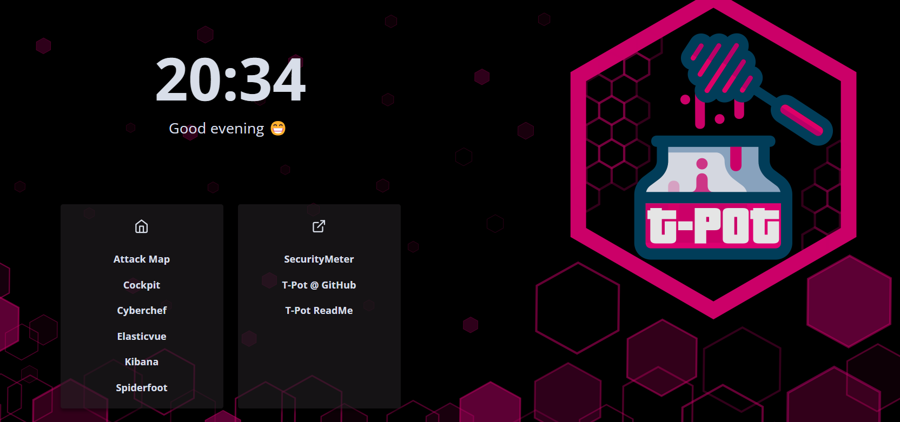

# AWS-TPot-SIEM

## Tools Used

T-Pot is the all in one honeypot platform used for this project.
https://github.com/telekom-security/tpotce

## Introduction

In an era where cybersecurity is paramount, the need for proactive measures to identify and understand potential threats has never been more crucial. This project delves into the realm of digital security by implementing a honeypot system on Amazon Web Services' Elastic Compute Cloud (AWS EC2), fortified by the advanced capabilities of TPOTCE (Total Platform for Open Source Cybersecurity Intelligence).

## Process

TPOTCE: A Comprehensive Honeypot Platform:

At the heart of our cybersecurity initiative is TPOTCE, an all-in-one honeypot platform that consolidates various open-source tools and techniques. TPOTCE not only streamlines the deployment of honeypots but also provides an extensive set of features to analyze, document, and respond to cyber threats effectively.

Monitoring and Visualization with Elastic Dashboard:

The key differentiator in our approach is the integration of an Elastic Dashboard, which serves as a centralized hub for monitoring and visualizing the incoming attacks. By leveraging the power of Elastic Stack, we can analyze and interpret data from the honeypot in real-time, gaining insights into the tactics, techniques, and procedures employed by potential adversaries.

## Results

After approximate 36 hrs of operation time while I had this honey pot up from the dash board it said it has recieved over 2 million attacks. Which I know it could be possible since I had reason to believe last night approximate at the 10 hr mark I was unable to log into the honeypot and monitor from the web app due to a attack.

Here are the logs that I gathered over the time while this honey pot was active.

T-Pot Dashboard

For fun I did perform a spiderfoot scan on a known attacker that was attacking my honeypot. Not sure if this was what caused my box from not responding, but it lasted for a few hours then when I woke up and checked the honeypot it was working again. But I am also now not recieving any more attacks which makes me think that I may have been removed from the tpotce platform due to my honeypot getting hit so fast and so much during the attack.

## What I learned

- AWS EC2 Cloud tools and security practices.
- Elastic Dashboards: this gave me a really cool experience with such a powerful data visualizing tool.
- This was a really cool oppurtunity to learn more about SIEMs and detecting attacks over a network.

\o/ Can't wait to work on some more Cyber Security Projects!!!
